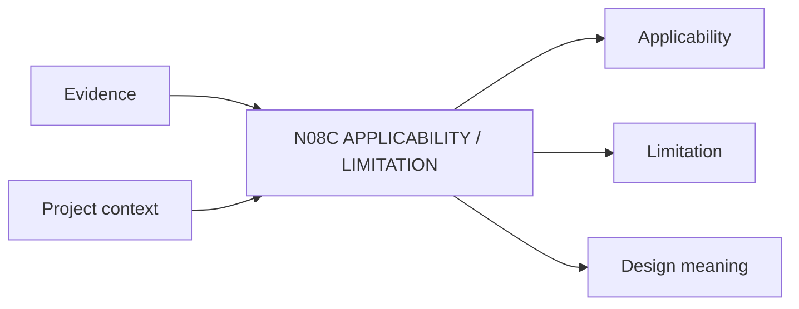

# N08C｜APPLICABILITY / LIMITATION

[← Parent](../N08_KNOWLEDGE.md) · [← Atomic Node Index](../ATOMIC_NODE_INDEX.md)

| Field | Value |
|---|---|
| Node ID | N08C |
| Parent | N08 KNOWLEDGE |
| Type | Atomic Knowledge Node |
| Product job | 明确证据适用于哪里、条件是什么、不能推出什么 |
| Inputs | Evidence; Project context |
| Outputs | Applicability; Limitation; Design meaning |
| Authority | Domain/Human may challenge transfer |
| Primary metric | Applicability Correction Rate |
| Release priority | P0 |
| Doc state | WORKING |

## Context Graph

## Product Contract

Evidence strength 与 project fit 分开；强证据在错误 population/context 中仍可能不适用。

## Requirement Links

- `KNW-F04`
- `KNW-F05`
- `KNW-F06`

## Acceptance

1. where applies/conditions/non-transferable parts 明确
2. 能回到 design consequence

## Failure / Degraded Behaviour

- fit unknown → conditional, not universal

## Events / Metrics

- `evidence_applicability_set`
- `evidence_limitation_recorded`

## Relations

- Consumes N08B
- Feeds N04B/N07D/N07E
