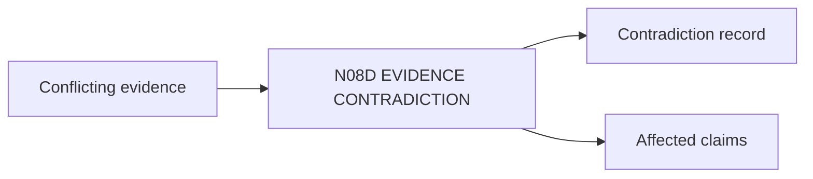

# N08D｜EVIDENCE CONTRADICTION

[← Parent](../N08_KNOWLEDGE.md) · [← Atomic Node Index](../ATOMIC_NODE_INDEX.md)

| Field | Value |
|---|---|
| Node ID | N08D |
| Parent | N08 KNOWLEDGE |
| Type | Atomic Knowledge Node |
| Product job | 保留来源冲突并指出对当前设计问题的影响 |
| Inputs | Conflicting evidence |
| Outputs | Contradiction record; Affected claims |
| Authority | No fake consensus |
| Primary metric | Contradiction Resolution Quality |
| Release priority | P1 |
| Doc state | WORKING |

## Context Graph

## Product Contract

多个来源冲突时不做无依据平均；每个来源和适用性保持独立。

## Requirement Links

- `KNW-F07`

## Acceptance

1. conflict sources preserved
2. affected question/relation explicit
3. resolution basis recorded

## Failure / Degraded Behaviour

- cannot resolve → OPEN contradiction + claim limit

## Events / Metrics

- `evidence_contradiction_detected`
- `evidence_contradiction_resolved`

## Relations

- Feeds N08E/N02D/N07
