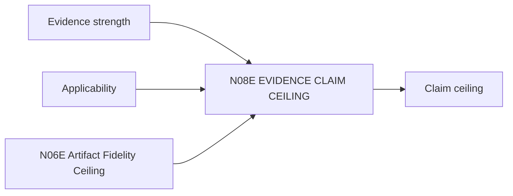

# N08E｜EVIDENCE CLAIM CEILING

[← Parent](../N08_KNOWLEDGE.md) · [← Atomic Node Index](../ATOMIC_NODE_INDEX.md)

| Field | Value |
|---|---|
| Node ID | N08E |
| Parent | N08 KNOWLEDGE |
| Type | Atomic Knowledge Node |
| Product job | 把 evidence strength + applicability 转成 evidence-side claim ceiling，并与 artifact-side fidelity ceiling 组合 |
| Inputs | Evidence strength; Applicability; N06E Artifact Fidelity Ceiling |
| Outputs | Claim ceiling |
| Authority | Cannot be relaxed without stronger basis |
| Primary metric | Overclaim Rate |
| Release priority | P0 |
| Doc state | WORKING |

## Context Graph

## Product Contract

有效 Claim Ceiling = evidence-side ceiling 与 artifact-side fidelity ceiling 中更严格的相关限制；两者不再各自声称拥有最终 ceiling。证据不足时降低 claim，不冻结无关 reversible design。

## Requirement Links

- `KNW-F11`
- `REV-F12`
- `ART-F09`

## Acceptance

1. claim 与 evidence/fidelity 匹配
2. does-not-prove 显式

## Failure / Degraded Behaviour

- basis unknown → conservative ceiling

## Events / Metrics

- `claim_ceiling_set`
- `overclaim_blocked`

## Relations

- Consumes N08B/N08C/N06E
- Feeds N07D/N07E/N01C
