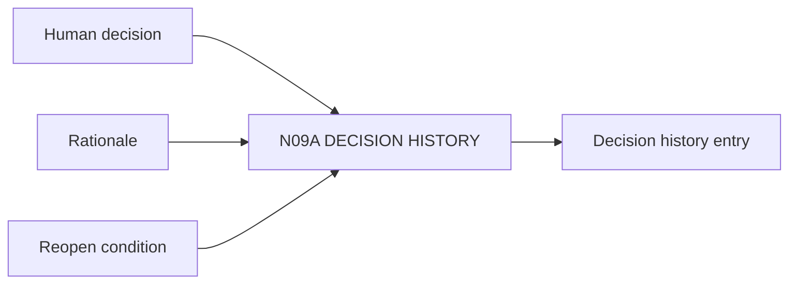

# N09A｜DECISION HISTORY

[← Parent](../N09_HISTORY.md) · [← Atomic Node Index](../ATOMIC_NODE_INDEX.md)

| Field | Value |
|---|---|
| Node ID | N09A |
| Parent | N09 HISTORY |
| Type | Atomic Continuity Node |
| Product job | 保存 consequential decision 的 actor、basis、accepted cost 与 reopen condition |
| Inputs | Human decision; Rationale; Reopen condition |
| Outputs | Decision history entry |
| Authority | History preserves; does not alter original authority |
| Primary metric | Decision Trace Completeness |
| Release priority | P0 |
| Doc state | WORKING |

## Context Graph

## Product Contract

历史记录为什么这样走，而不是只记录‘选了 B’。

## Requirement Links

- `HIS-F02`
- `CMP-F06`
- `CMP-F07`

## Acceptance

1. actor/authority/basis/uncertainty/reopen condition 可查
2. exact referent/revision 可追踪

## Failure / Degraded Behaviour

- rationale absent → preserve UNKNOWN

## Events / Metrics

- `decision_history_recorded`

## Relations

- Consumes N04C/N04D
- Feeds N10A
