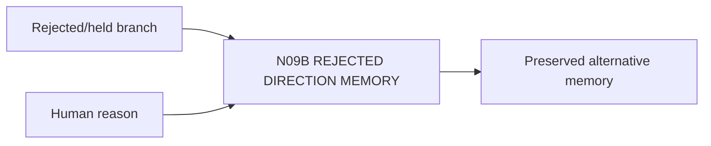

# N09B｜REJECTED DIRECTION MEMORY

[← Parent](../N09_HISTORY.md) · [← Atomic Node Index](../ATOMIC_NODE_INDEX.md)

| Field | Value |
|---|---|
| Node ID | N09B |
| Parent | N09 HISTORY |
| Type | Atomic Continuity Node |
| Product job | 保存被拒绝/暂停方向的 lineage、价值与未来重开条件 |
| Inputs | Rejected/held branch; Human reason |
| Outputs | Preserved alternative memory |
| Authority | Rejected branch is non-current, not deleted |
| Primary metric | Rejected Branch Recoverability |
| Release priority | P1 |
| Doc state | WORKING |

## Context Graph

## Product Contract

Rejected ≠ deleted；避免未来重复生成已知失败方向或丢失仍有价值部分。

## Requirement Links

- `HIS-F03`
- `EXP-F07`

## Acceptance

1. branch identity/why rejected/valuable residue/reopen condition 可查

## Failure / Degraded Behaviour

- reason absent → do not fabricate

## Events / Metrics

- `branch_rejected`
- `branch_reopened`

## Relations

- Feeds N04D/N10B/N03A
