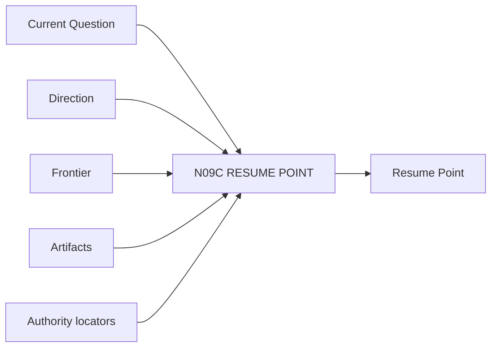

# N09C｜RESUME POINT

[← Parent](../N09_HISTORY.md) · [← Atomic Node Index](../ATOMIC_NODE_INDEX.md)

| Field | Value |
|---|---|
| Node ID | N09C |
| Parent | N09 HISTORY |
| Type | Atomic Continuity Node |
| Product job | 为跨 session/person/agent 恢复提供 owner-native locator 集合 |
| Inputs | Current Question; Direction; Frontier; Artifacts; Authority locators |
| Outputs | Resume Point |
| Authority | Locator set only; not plugin-owned Project State |
| Primary metric | Resume-point Success |
| Release priority | P0 |
| Doc state | WORKING |

## Context Graph

## Product Contract

Resume Point 只保存可重新解析 owner-native truth 的定位信息和必要投影。

## Requirement Links

- `HIS-F06`
- `INT-F25`
- `INT-F26`

## Acceptance

1. Current/Frontier/Open/Artifact/Next Action/source carrier locators 齐全
2. 可在新 session 重建

## Failure / Degraded Behaviour

- stale locator → N10A re-resolve

## Events / Metrics

- `resume_point_created`
- `resume_point_used`

## Relations

- Feeds N10A/N01A
