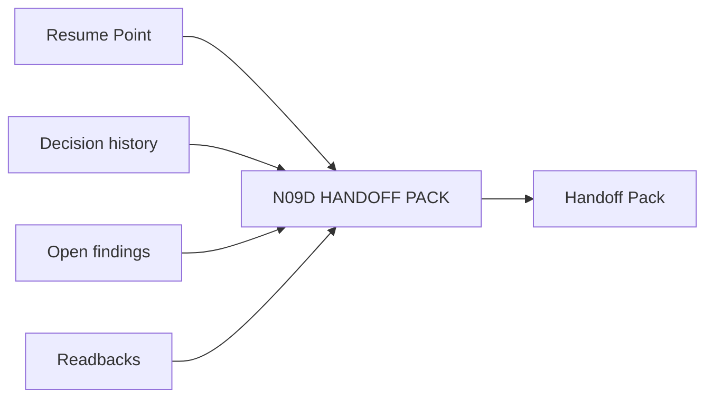

# N09D｜HANDOFF PACK

[← Parent](../N09_HISTORY.md) · [← Atomic Node Index](../ATOMIC_NODE_INDEX.md)

| Field | Value |
|---|---|
| Node ID | N09D |
| Parent | N09 HISTORY |
| Type | Atomic Continuity Node |
| Product job | 让下一个设计者/Agent 理解当前工作并可质疑上游解释 |
| Inputs | Resume Point; Decision history; Open findings; Readbacks |
| Outputs | Handoff Pack |
| Authority | Handoff does not equal recipient acceptance |
| Primary metric | Handoff Correction Rate |
| Release priority | P1 |
| Doc state | WORKING |

## Context Graph

## Product Contract

handoff 保留 current question/value/relation/decision/open/artifact/readback/claim limits。

## Requirement Links

- `HIS-F07`
- `SR-IF`

## Acceptance

1. recipient can continue without archaeology
2. source links progressive disclosure
3. recipient can challenge upstream

## Failure / Degraded Behaviour

- missing critical carrier → handoff partial

## Events / Metrics

- `handoff_pack_created`
- `handoff_corrected`

## Relations

- Consumes N09A/N09C/N07/N06
- Feeds Human/Agent transition
