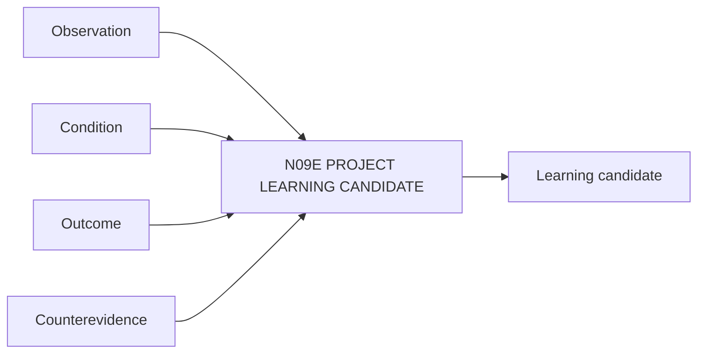

# N09E｜PROJECT LEARNING CANDIDATE

[← Parent](../N09_HISTORY.md) · [← Atomic Node Index](../ATOMIC_NODE_INDEX.md)

| Field | Value |
|---|---|
| Node ID | N09E |
| Parent | N09 HISTORY |
| Type | Atomic Learning Node |
| Product job | 把项目经验形成可复用候选，而不是自动升级成普遍规则 |
| Inputs | Observation; Condition; Outcome; Counterevidence |
| Outputs | Learning candidate |
| Authority | No auto-promotion to professional rule |
| Primary metric | Transfer Correction / Reuse Value |
| Release priority | P2 |
| Doc state | WORKING |

## Context Graph

## Product Contract

每条 learning candidate 记录 transfer condition 与 counterevidence。

## Requirement Links

- `HIS-F09`
- `SR-PL`

## Acceptance

1. observation/condition/outcome/transfer boundary 分开
2. 跨项目使用可被重新验证

## Failure / Degraded Behaviour

- single anecdote → remains low-confidence candidate

## Events / Metrics

- `learning_candidate_created`
- `learning_candidate_reused`

## Relations

- Feeds N08 knowledge with candidate status only
