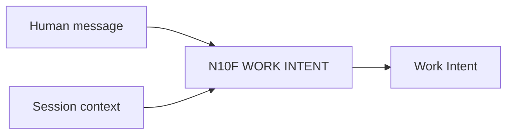

# N10F｜WORK INTENT

[← Parent](../N10_SESSION_KERNEL.md) · [← Atomic Node Index](../ATOMIC_NODE_INDEX.md)

| Field | Value |
|---|---|
| Node ID | N10F |
| Parent | N10 SESSION KERNEL |
| Type | Atomic Interaction Axis |
| Product job | 识别用户当前想完成哪类工作，而不推导 mutation/authority |
| Inputs | Human message; Session context |
| Outputs | Work Intent |
| Authority | Classification only |
| Primary metric | Intent Correction Rate |
| Release priority | P0 |
| Doc state | WORKING |

## Context Graph

## Product Contract

START/RESUME/RECOVER/EXPLORE/WILDCARD/REVIEW/REFRAME/SAVE_ROUTE/EXPLAIN/SHOW_WORK/UNRESOLVED。

## Requirement Links

- `INT-F01`

## Acceptance

1. ‘继续’=RESUME，不变成 steer
2. intent 可与 READ_ONLY/AUTO_ADVANCE 独立组合

## Failure / Degraded Behaviour

- unresolved → ask minimum clarification only if needed

## Events / Metrics

- `work_intent_resolved`

## Relations

- Sibling N10G/N10H/N10I
