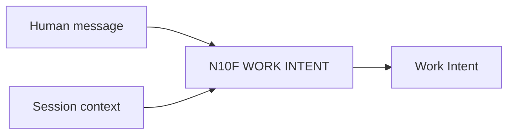

# N10F｜WORK INTENT

[← Parent](../N10_SESSION_KERNEL.md) · [← Atomic Node Index](../ATOMIC_NODE_INDEX.md)

| Field | Value |
|---|---|
| Node ID | N10F |
| Parent | N10 SESSION KERNEL |
| Type | Atomic Interaction Axis |
| Product job | 识别用户当前想完成哪类工作，而不推导 mutation/authority |
| Inputs | Human message; Session context |
| Outputs | Work Intent |
| Authority | Classification only |
| Primary metric | Intent Correction Rate |
| Release priority | P0 |
| Doc state | WORKING |

## Context Graph

## Product Contract

START / RESUME / CONTINUE / RECOVER / EXPLORE / DEVELOP / SYNTHESIZE / COMPARE / REVIEW / REFRAME / EXPLAIN / DELEGATE / STOP / UNRESOLVED。

`WILDCARD` and `SAVE_ROUTE` are runtime/execution concepts, not Human work intents.

## Intent Semantics

| Intent | Meaning |
|---|---|
| START | 开始一个新的 bounded work context |
| RESUME | 新 session / interaction context 已丢失后，从 owner-native carriers 恢复 |
| CONTINUE | 当前 session / frontier / 已授权路径继续推进 |
| RECOVER | 工具中断、失败、state conflict 或 partial completion 后恢复 |
| EXPLORE | 扩展 search space / alternatives |
| DEVELOP | 深化已选或当前方向 |
| SYNTHESIZE | 综合多个方向/反馈形成新 coherent direction |
| COMPARE | 比较 options / revisions / outcomes |
| REVIEW | critique / verification / validation / readback review |
| REFRAME | 改变问题定义或 decision object |
| EXPLAIN | 要求解释 reasoning / evidence / trade-off |
| DELEGATE | 将明确工作交给 AI 执行，仍受 action/authority guard |
| STOP | 停止当前推进 |

## Requirement Links

- `INT-F01`

## Acceptance

1. 新 session 中“继续”在需要恢复 context 时可解析为 RESUME
2. 当前 session 已有有效 frontier 时“继续”优先解析为 CONTINUE
3. 工具失败/partial completion 后“继续”可解析为 RECOVER
4. CONTINUE 仍不自动等于 Human steer / Design Decision
5. intent 可与 READ_ONLY/AUTO_ADVANCE 独立组合

## Failure / Degraded Behaviour

- unresolved → ask minimum clarification only if needed

## Events / Metrics

- `work_intent_resolved`

## Relations

- Sibling N10G/N10H/N10I/N10J
