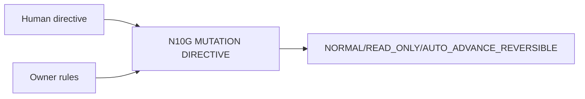

# N10G｜MUTATION DIRECTIVE

[← Parent](../N10_SESSION_KERNEL.md) · [← Atomic Node Index](../ATOMIC_NODE_INDEX.md)

| Field | Value |
|---|---|
| Node ID | N10G |
| Parent | N10 SESSION KERNEL |
| Type | Atomic Interaction Axis |
| Product job | 表达本轮允许何种 mutation 范围 |
| Inputs | Human directive; Owner rules |
| Outputs | NORMAL/READ_ONLY/AUTO_ADVANCE_REVERSIBLE |
| Authority | Cannot override owner authority |
| Primary metric | Directive Violation Rate |
| Release priority | P0 |
| Doc state | WORKING |

## Context Graph

## Product Contract

READ_ONLY 零 mutation；AUTO_ADVANCE 只授权 reversible flow，不授权 Human-only decision。

## Requirement Links

- `INT-F02`
- `INT-F20`

## Acceptance

1. RESUME+READ_ONLY 可组合
2. READ_ONLY outranks ordinary auto-advance

## Failure / Degraded Behaviour

- directive conflict → safest valid interpretation / clarification

## Events / Metrics

- `mutation_directive_resolved`
- `readonly_guard_applied`

## Relations

- Feeds N10C/N10D
