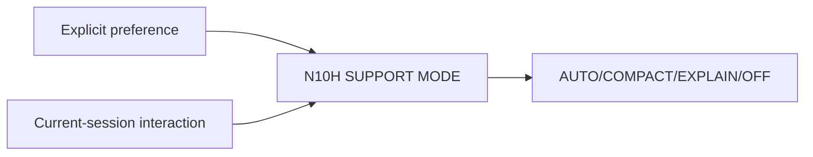

# N10H｜SUPPORT MODE

[← Parent](../N10_SESSION_KERNEL.md) · [← Atomic Node Index](../ATOMIC_NODE_INDEX.md)

| Field | Value |
|---|---|
| Node ID | N10H |
| Parent | N10 SESSION KERNEL |
| Type | Atomic Interaction Axis |
| Product job | 控制解释/设计学习支持的强度，不改变 authority |
| Inputs | Explicit preference; Current-session interaction |
| Outputs | AUTO/COMPACT/EXPLAIN/OFF |
| Authority | Presentation/support only |
| Primary metric | Explanation Interruption Rate |
| Release priority | P1 |
| Doc state | WORKING |

## Context Graph

## Product Contract

Support Mode 不改变 verification、guard、maturity 或 competence status。

## Requirement Links

- `INT-F03`
- `INT-F23`
- `INT-F24`

## Acceptance

1. ‘少解释’不降低安全强度
2. session fade 不写成 durable ability profile

## Failure / Degraded Behaviour

- no preference → AUTO

## Events / Metrics

- `support_mode_changed`
- `support_inserted`

## Relations

- May surface in N13 Settings; remains session-bounded by default
