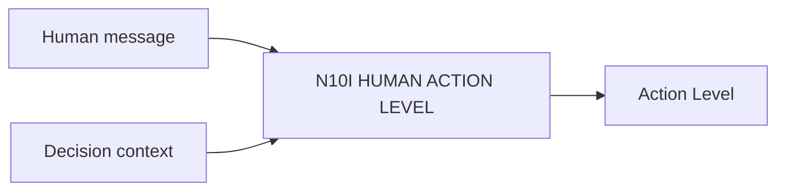

# N10I｜HUMAN ACTION LEVEL

[← Parent](../N10_SESSION_KERNEL.md) · [← Atomic Node Index](../ATOMIC_NODE_INDEX.md)

| Field | Value |
|---|---|
| Node ID | N10I |
| Parent | N10 SESSION KERNEL |
| Type | Atomic Interaction Axis |
| Product job | 区分 feedback、iteration steer、design decision、Design KEEP、Promotion decision |
| Inputs | Human message; Decision context |
| Outputs | Action Level |
| Authority | Higher levels route to existing authority |
| Primary metric | Action-level Collapse Rate |
| Release priority | P0 |
| Doc state | WORKING |

## Context Graph

## Product Contract

FEEDBACK_SIGNAL ≠ ITERATION_STEER ≠ DESIGN_DECISION ≠ DESIGN_KEEP ≠ PROMOTION_DECISION。

## Requirement Links

- `INT-F04`
- `INT-F05`

## Acceptance

1. ‘这个不对’不自动成为 reject
2. ‘DESIGN KEEP’不由 kernel 自己执行
3. latest message 不升级 authority

## Failure / Degraded Behaviour

- ambiguous consequence → preserve lower non-mutating interpretation until clarified

## Events / Metrics

- `human_action_level_resolved`

## Relations

- Feeds N10B/N11
