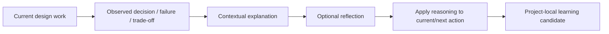

# N10J｜DESIGNER DEVELOPMENT

[← Parent](../N10_SESSION_KERNEL.md) · [← Atomic Node Index](../ATOMIC_NODE_INDEX.md)

| Field | Value |
|---|---|
| Node ID | N10J |
| Parent | N10 SESSION KERNEL |
| Type | Atomic Human–AI Learning Capability |
| Product job | 在不建立永久能力/心理画像的前提下，让 AI collaboration 帮助设计者理解 reasoning、trade-off、failure 与 professional consequence |
| Inputs | Current design work; Human question; Compare/Review findings; Support Mode |
| Outputs | Contextual explanation; Reflection prompt; Design reasoning exposure; Project-local learning candidate |
| Authority | Support/learning only; never changes design/professional authority |
| Primary metric | Explanation Usefulness / Interruption / Learning Transfer |
| Release priority | P1 |
| Doc state | WORKING |

## Context Graph



## Product Contract

Designer Development is contextual support embedded in real design work. It exposes reasoning and reflection when useful without turning ordinary project behaviour into a durable competence, taste or psychological profile.

## Supported Behaviours

- explain why two alternatives differ in mechanism/consequence
- expose professional reasoning behind a finding
- explain why a repair failed after readback
- show what evidence changed the claim
- support decision reflection after a consequential choice
- reduce support intensity within the current session when repeated explanation is not needed

## Hard Boundary

```text
contextual learning support
≠ permanent competence profile
≠ psychological profile
≠ hidden score of designer quality
≠ professional qualification
```

## Requirement Links

- `INT-F23`
- `INT-F24`
- `HIS-F09`
## Acceptance

1. support remains optional and contextual
2. repeated Human steering does not become a durable taste/competence label
3. explanation never changes verification/authority status
4. project learning may be preserved as N09E candidate, not as a universal rule about the person

## Failure / Degraded Behaviour

- explanation interrupts urgent execution → reduce via N10H Support Mode
- insufficient evidence → explain uncertainty rather than teaching fabricated certainty

## Events / Metrics

- `designer_support_shown`
- `reflection_used`
- `support_faded_session_local`

## Relations

- Consumes N10H/N04/N07/N08
- Feeds N09E only as project-learning candidate
