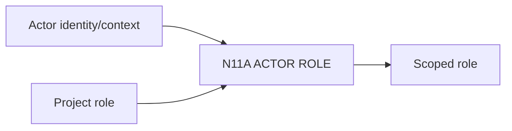

# N11A｜ACTOR ROLE

[← Parent](../N11_PEOPLE_AUTHORITY.md) · [← Atomic Node Index](../ATOMIC_NODE_INDEX.md)

| Field | Value |
|---|---|
| Node ID | N11A |
| Parent | N11 PEOPLE / AUTHORITY |
| Type | Atomic Authority Node |
| Product job | 识别 Human 参与者在当前 decision context 中的角色 |
| Inputs | Actor identity/context; Project role |
| Outputs | Scoped role |
| Authority | Role assignment follows owner rules |
| Primary metric | Role Resolution Correction |
| Release priority | P1 |
| Doc state | WORKING |

## Context Graph

## Product Contract

Designer/Client/Specialist/Reviewer/Project Authority/Promotion Authority 分开。

## Requirement Links

- `PEO-F01`

## Acceptance

1. role 有 scope
2. 角色名称本身不授予全局 authority

## Failure / Degraded Behaviour

- role unknown → no authority escalation

## Events / Metrics

- `actor_role_resolved`

## Relations

- Feeds N11B
