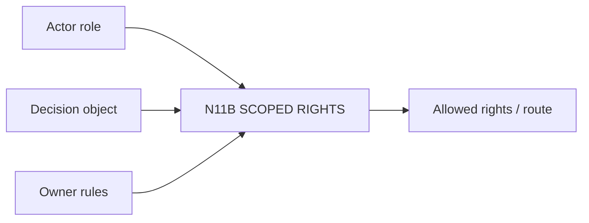

# N11B｜SCOPED RIGHTS

[← Parent](../N11_PEOPLE_AUTHORITY.md) · [← Atomic Node Index](../ATOMIC_NODE_INDEX.md)

| Field | Value |
|---|---|
| Node ID | N11B |
| Parent | N11 PEOPLE / AUTHORITY |
| Type | Atomic Authority Node |
| Product job | 判断某个 actor 是否有权对当前 effect/decision object 作 consequential decision |
| Inputs | Actor role; Decision object; Owner rules |
| Outputs | Allowed rights / route |
| Authority | Existing owner-native rights are canonical |
| Primary metric | Unauthorized Override Rate |
| Release priority | P0 |
| Doc state | WORKING |

## Context Graph

## Product Contract

latest Human message never becomes universal authority。

## Requirement Links

- `PEO-F02`

## Acceptance

1. rights 绑定 scope/effect
2. client / stakeholder value priority only applies where current project rights explicitly grant it
3. Client 不制造 specialist compliance
4. Specialist 不拥有 whole-design authority

## Failure / Degraded Behaviour

- rights unclear → HOLD affected effect

## Events / Metrics

- `decision_rights_resolved`
- `authority_route_required`

## Relations

- Feeds N10B/N10C/N10D
