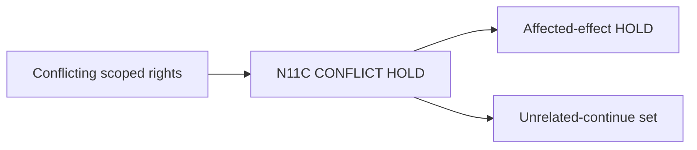

# N11C｜CONFLICT HOLD

[← Parent](../N11_PEOPLE_AUTHORITY.md) · [← Atomic Node Index](../ATOMIC_NODE_INDEX.md)

| Field | Value |
|---|---|
| Node ID | N11C |
| Parent | N11 PEOPLE / AUTHORITY |
| Type | Atomic Authority Node |
| Product job | 多人权责冲突时只冻结受影响 effect，并让无关 reversible work 继续 |
| Inputs | Conflicting scoped rights |
| Outputs | Affected-effect HOLD; Unrelated-continue set |
| Authority | Conflict resolution follows owner rules |
| Primary metric | Conflict Containment Rate |
| Release priority | P1 |
| Doc state | WORKING |

## Context Graph

## Product Contract

冲突不默认冻结整个项目。

## Requirement Links

- `PEO-F03`

## Acceptance

1. affected effect 明确
2. unrelated reversible work preserved
3. conflict actor/source retained

## Failure / Degraded Behaviour

- scope cannot be isolated → broader HOLD with reason

## Events / Metrics

- `decision_rights_conflict`
- `scoped_hold_created`

## Relations

- Uses N05B impact
- Feeds N10C
