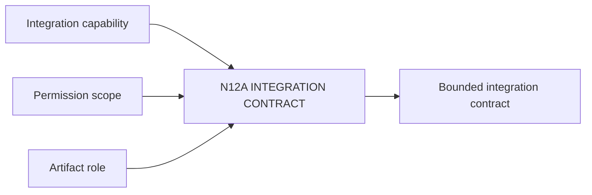

# N12A｜INTEGRATION CONTRACT

[← Parent](../N12_INTEGRATIONS.md) · [← Atomic Node Index](../ATOMIC_NODE_INDEX.md)

| Field | Value |
|---|---|
| Node ID | N12A |
| Parent | N12 INTEGRATIONS |
| Type | Atomic Integration Node |
| Product job | 定义外部 authoring/analysis/storage 系统与 OLEANDER 交换什么、谁负责、失败如何处理 |
| Inputs | Integration capability; Permission scope; Artifact role |
| Outputs | Bounded integration contract |
| Authority | Connector capability does not grant project authority |
| Primary metric | Integration Success / Misroute |
| Release priority | P1 |
| Doc state | WORKING |

## Context Graph

## Product Contract

每个 integration 至少回答 producer、consumer、payload、authority、acknowledgement、provenance、failure path。

## Requirement Links

- `SR-IF`
- `NFR-10`

## Acceptance

1. 输入输出与 role 明确
2. permission 最小化
3. readback path 已定义

## Failure / Degraded Behaviour

- 接口能力不足 → degraded or HOLD，不伪造 completion

## Events / Metrics

- `integration_contract_bound`
- `integration_capability_missing`

## Relations

- Feeds N12B/N12C/N06
