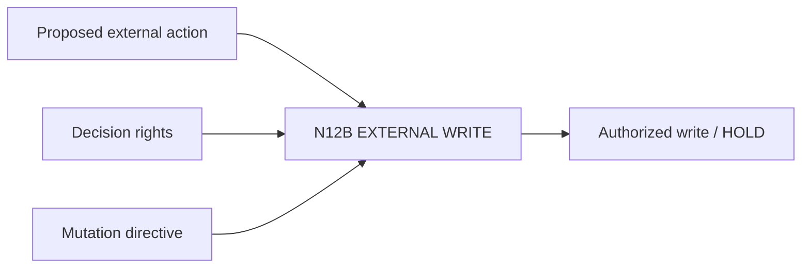

# N12B｜EXTERNAL WRITE

[← Parent](../N12_INTEGRATIONS.md) · [← Atomic Node Index](../ATOMIC_NODE_INDEX.md)

| Field | Value |
|---|---|
| Node ID | N12B |
| Parent | N12 INTEGRATIONS |
| Type | Atomic Integration Node |
| Product job | 控制发布、提交、发送、远端写入等不可逆或外部 side effect |
| Inputs | Proposed external action; Decision rights; Mutation directive |
| Outputs | Authorized write / HOLD |
| Authority | Explicit Human/owner authorization required |
| Primary metric | Unauthorized External Write |
| Release priority | P0 |
| Doc state | WORKING |

## Context Graph

## Product Contract

外部不可逆/publishing action 永远不能由普通 continue/auto-advance 隐式授权。

## Requirement Links

- `INT-F16`
- `INT-F17`
- `PEO-F02`

## Acceptance

1. target/action/scope 明确
2. authorization 绑定 current action
3. partial success 可被报告

## Failure / Degraded Behaviour

- authorization missing → HOLD
- partial write → report exact completed/failed effects

## Events / Metrics

- `external_write_authorized`
- `external_write_completed`
- `external_write_partial`

## Relations

- Uses N10C/N10D/N11B
- May create N14 incident
