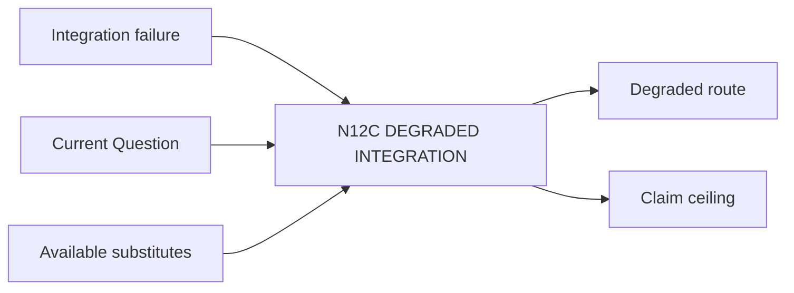

# N12C｜DEGRADED INTEGRATION

[← Parent](../N12_INTEGRATIONS.md) · [← Atomic Node Index](../ATOMIC_NODE_INDEX.md)

| Field | Value |
|---|---|
| Node ID | N12C |
| Parent | N12 INTEGRATIONS |
| Type | Atomic Integration Node |
| Product job | 外部工具不可用时选择 truthful fallback 或明确 HOLD |
| Inputs | Integration failure; Current Question; Available substitutes |
| Outputs | Degraded route; Claim ceiling |
| Authority | Fallback cannot invent native capability |
| Primary metric | Degraded Route Success |
| Release priority | P1 |
| Doc state | WORKING |

## Context Graph

## Product Contract

能力缺失降低 scope/claim，不改变 project truth。

## Requirement Links

- `ART-F12`
- `NFR-10`

## Acceptance

1. what failed/what remains valid/what blocked/fallback 明确
2. substitute 能回答 key unknown 才使用

## Failure / Degraded Behaviour

- 无 truthful fallback → HOLD affected effect

## Events / Metrics

- `integration_degraded`
- `integration_fallback_used`

## Relations

- Uses N06F/N14B
- Feeds N10C
