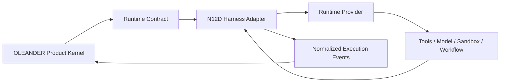

# N12D｜HARNESS / RUNTIME ADAPTER

[← Parent](../N12_INTEGRATIONS.md) · [← Atomic Node Index](../ATOMIC_NODE_INDEX.md)

| Field | Value |
|---|---|
| Node ID | N12D |
| Parent | N12 INTEGRATIONS |
| Type | Atomic Runtime Integration Node |
| Product job | 把 session/tool/sandbox/approval/trace/workflow runtime 封装成可替换 provider，而不迁移 OLEANDER product authority |
| Inputs | OLEANDER Runtime Contract; provider capability set; scoped permission |
| Outputs | normalized runtime action/result/events/health |
| Authority | Runtime provider has execution capability only; Project/Decision/Artifact authority remains external |
| Primary metric | Provider Conformance / Authority Leakage / Runtime Portability |
| Release priority | P0 |
| Doc state | WORKING |

## Context Graph



## Product Contract

Provider-native concepts are implementation details unless explicitly mapped.

```text
provider session ≠ Project State
provider workflow ≠ Design Process authority
provider approval ≠ Human Design Decision
provider log ≠ Project Current
provider completion ≠ OLEANDER completion
```

## Requirement Links

- `HAR-F01`
- `HAR-F02`
- `HAR-F03`
- `HAR-F04`
- `HAR-F05`
- `HAR-F06`

## Acceptance

1. provider may be removed/replaced without redefining Product State semantics；
2. provider session/log identifiers remain trace locators only；
3. Action Guard runs before provider execution approval where product authority is involved；
4. provider result becomes project truth only through explicit OLEANDER validation/update path；
5. partial execution remains partial after normalization；
6. provider health/degradation is surfaced to N14；
7. provider-specific capability absent → bounded degradation rather than hidden fallback。

## Failure / Degraded Behaviour

- provider unavailable → route to another compliant provider or scoped HOLD；
- provider API drift → fail conformance / disable affected capability；
- provider replay diverges → keep execution evidence, do not update Project State；
- provider requires owning canonical state → reject adapter design。

## Events / Metrics

- `runtime_provider_selected`
- `runtime_provider_switched`
- `runtime_event_normalized`
- `runtime_conformance_failed`
- `runtime_authority_leak_blocked`

## Relations

- Consumes N10D/N12A/N13A/N13B
- Feeds N06G/N14A/N14B/N14C
