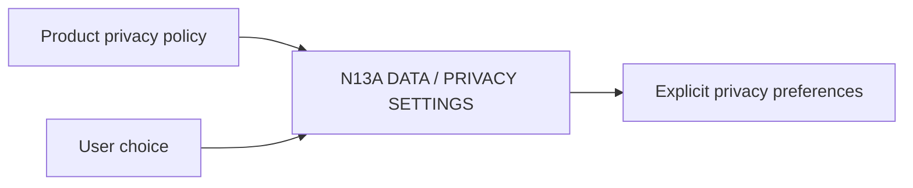

# N13A｜DATA / PRIVACY SETTINGS

[← Parent](../N13_SETTINGS.md) · [← Atomic Node Index](../ATOMIC_NODE_INDEX.md)

| Field | Value |
|---|---|
| Node ID | N13A |
| Parent | N13 SETTINGS |
| Type | Atomic Settings Node |
| Product job | 向用户暴露必要的数据使用、保留与分享控制 |
| Inputs | Product privacy policy; User choice |
| Outputs | Explicit privacy preferences |
| Authority | Cannot weaken legal/security requirements |
| Primary metric | Privacy Setting Comprehension |
| Release priority | P2 |
| Doc state | WORKING |

## Context Graph

## Product Contract

只暴露用户真正能控制的选项；未建立正式 policy 前保持 OPEN，不伪造企业合规。

## Requirement Links

- `NFR-12`

## Acceptance

1. choice 与实际数据行为一致
2. default/retention/share scope 可解释

## Failure / Degraded Behaviour

- policy unresolved → do not expose fake control

## Events / Metrics

- `privacy_setting_changed`

## Relations

- Feeds external pilot readiness
- Interacts N12 integrations
