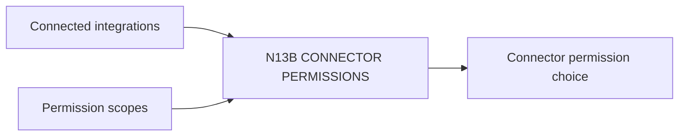

# N13B｜CONNECTOR PERMISSIONS

[← Parent](../N13_SETTINGS.md) · [← Atomic Node Index](../ATOMIC_NODE_INDEX.md)

| Field | Value |
|---|---|
| Node ID | N13B |
| Parent | N13 SETTINGS |
| Type | Atomic Settings Node |
| Product job | 让用户查看和调整已连接外部系统的产品级权限范围 |
| Inputs | Connected integrations; Permission scopes |
| Outputs | Connector permission choice |
| Authority | Cannot override provider/owner security policy |
| Primary metric | Overbroad Permission Rate |
| Release priority | P2 |
| Doc state | WORKING |

## Context Graph

## Product Contract

least privilege；permission UI 不等于 decision-right authorization。

## Requirement Links

- `NFR-05`
- `N12A`

## Acceptance

1. scope 可见
2. revocation path 明确
3. publish/write 权限与 project decision rights 分开

## Failure / Degraded Behaviour

- provider scope unknown → label unknown/reconnect required

## Events / Metrics

- `connector_permission_changed`
- `connector_revoked`

## Relations

- Uses N12A/N12B
