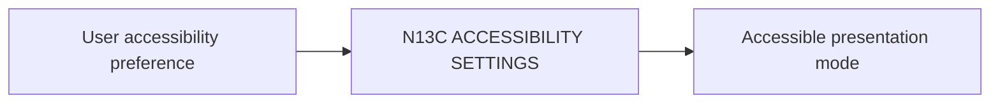

# N13C｜ACCESSIBILITY SETTINGS

[← Parent](../N13_SETTINGS.md) · [← Atomic Node Index](../ATOMIC_NODE_INDEX.md)

| Field | Value |
|---|---|
| Node ID | N13C |
| Parent | N13 SETTINGS |
| Type | Atomic Settings Node |
| Product job | 提供必要的显示/交互辅助偏好而不改变产品语义 |
| Inputs | User accessibility preference |
| Outputs | Accessible presentation mode |
| Authority | Presentation only |
| Primary metric | Accessibility Task Success |
| Release priority | P2 |
| Doc state | WORKING |

## Context Graph

## Product Contract

可访问性设置不能隐藏 critical state/authority information。

## Requirement Links

- `NFR-07`

## Acceptance

1. critical information remains equivalent
2. keyboard/contrast/text size requirements future-ready

## Failure / Degraded Behaviour

- unsupported preference → transparent limitation

## Events / Metrics

- `accessibility_setting_changed`

## Relations

- Affects all visible product surfaces
