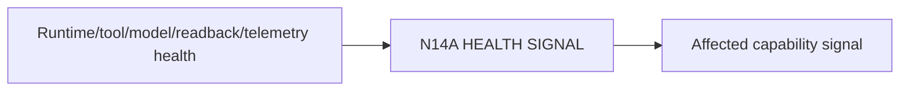

# N14A｜HEALTH SIGNAL

[← Parent](../N14_SYSTEM_HEALTH.md) · [← Atomic Node Index](../ATOMIC_NODE_INDEX.md)

| Field | Value |
|---|---|
| Node ID | N14A |
| Parent | N14 SYSTEM HEALTH |
| Type | Atomic Health Node |
| Product job | 把真正影响当前工作的 capability health 转成用户可理解信号 |
| Inputs | Runtime/tool/model/readback/telemetry health |
| Outputs | Affected capability signal |
| Authority | Health does not alter Project Current |
| Primary metric | Health Signal Accuracy |
| Release priority | P1 |
| Doc state | WORKING |

## Context Graph

## Product Contract

只暴露与用户当前工作有关的健康状态，不把 raw infrastructure logs 当主 UX。

## Requirement Links

- `NFR-03`
- `NFR-06`

## Acceptance

1. affected effect 明确
2. status 与实际能力一致
3. stale health 不静默显示 healthy

## Failure / Degraded Behaviour

- health unknown → UNKNOWN rather than green

## Events / Metrics

- `capability_health_changed`

## Relations

- Feeds N14B/N10C
