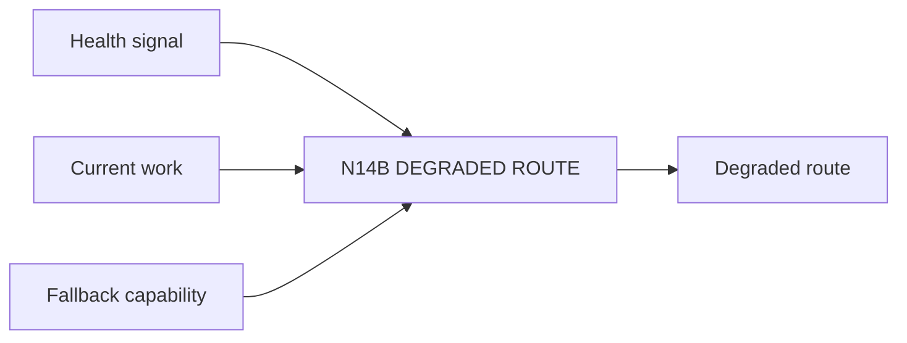

# N14B｜DEGRADED ROUTE

[← Parent](../N14_SYSTEM_HEALTH.md) · [← Atomic Node Index](../ATOMIC_NODE_INDEX.md)

| Field | Value |
|---|---|
| Node ID | N14B |
| Parent | N14 SYSTEM HEALTH |
| Type | Atomic Health Node |
| Product job | 能力失败时明确保留什么、阻止什么、如何降级继续 |
| Inputs | Health signal; Current work; Fallback capability |
| Outputs | Degraded route |
| Authority | No truth inflation |
| Primary metric | Truthful Degradation Rate |
| Release priority | P1 |
| Doc state | WORKING |

## Context Graph

## Product Contract

每次 degradation 必须回答 what failed / remains valid / blocked / fallback / Human action。

## Requirement Links

- `NFR-10`
- `N12C`

## Acceptance

1. fallback 与 claim ceiling 联动
2. 不把局部故障升级为全局 project failure

## Failure / Degraded Behaviour

- fallback impossible → HOLD affected effect

## Events / Metrics

- `degraded_route_started`
- `degraded_route_ended`

## Relations

- Consumes N14A
- Uses N12C/N06F
