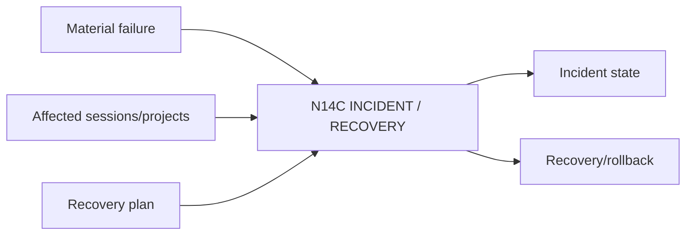

# N14C｜INCIDENT / RECOVERY

[← Parent](../N14_SYSTEM_HEALTH.md) · [← Atomic Node Index](../ATOMIC_NODE_INDEX.md)

| Field | Value |
|---|---|
| Node ID | N14C |
| Parent | N14 SYSTEM HEALTH |
| Type | Atomic Health Node |
| Product job | 记录影响用户工作的 product incident、恢复范围和 rollback 路径 |
| Inputs | Material failure; Affected sessions/projects; Recovery plan |
| Outputs | Incident state; Recovery/rollback |
| Authority | Operational; cannot rewrite project truth to hide incident |
| Primary metric | Recovery Time / Data-loss Incidents |
| Release priority | P1 |
| Doc state | WORKING |

## Context Graph

## Product Contract

rollback 必须保护仍有效的 owner-native project truth。

## Requirement Links

- `NFR-02`
- `NFR-06`
- `Launch Readiness`

## Acceptance

1. severity/owner/affected scope/recovery 明确
2. post-recovery project state 可验证

## Failure / Degraded Behaviour

- owner unavailable → escalate and HOLD risky operations

## Events / Metrics

- `incident_opened`
- `rollback_started`
- `incident_recovered`

## Relations

- Uses N14A/N14B
- Feeds Launch Readiness
